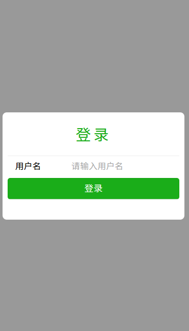
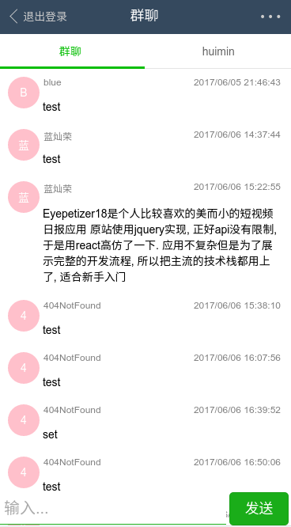
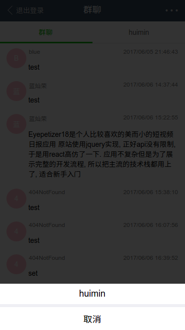

# socket.io immediate chat room

[中文文档](./docs/README_zh_cn.md)

[online preview](http://182.254.231.203:3000/)(username: blue, password: huimin)

## glance

- login page

  

- group chat page

  

- others list

  

- private chat page

  

## install dependencies

1. node7.x

2. auto restart node server tool

```
npm i -g nodemon
```

3. QA tool

    install eslint plugin for your code editor(like "eslint" in vscode)

## download

``` bash
# clone
git clone git@github.com:Chanran/vueSocketChatroom.git
cd vueSocketChatroom

# install dependencies
npm install -d
```

## start

```
npm run dev
npm run server # open another terminal
```

visit [http://localhost:8080/](http://localhost:8080/)

## deploy

```
npm install -g pm2 # install just once
npm i -d --production
npm run build
npm run deploy
```

## tech docs

- [api docs](https://www.showdoc.cc/1629169?page_id=14974136)
- [vue2](https://vuejs.org/)
- [vue-router2](https://router.vuejs.org/en/)
- [vuex](https://vuex.vuejs.org/en/)
- [vue-loader](https://vue-loader.vuejs.org/en/)
- [vux](https://vux.li/#/)
- [express4.x](https://expressjs.com/)
- [mongodb](https://docs.mongodb.com/)

## License

[MIT](./LICENSE)
